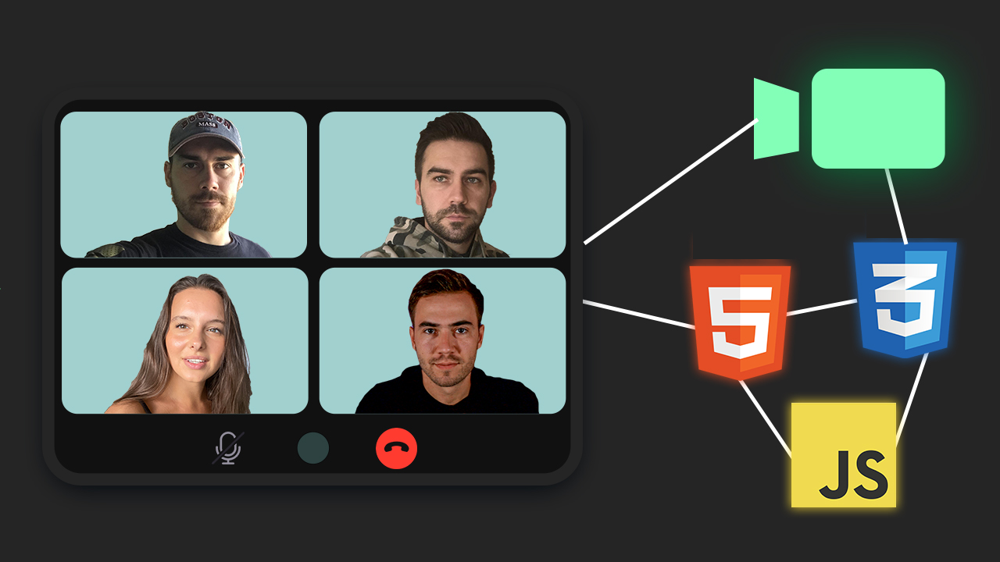

# group-video-chat
Simple group video chat app built using plain HTML, CSS, JavaScript and the Agora SDK

# Usage
* 1. Create an account on agora.io and get APP ID, Temp Token and Channel Name
* 2. Update APP ID, Temp Token and Channel Name in script.js
* 3. If you are using vscode, you can install live server on vscode extension
* 4. Select `index.html`, run it on live server(localhost)
```
Note: developer account on Agora has a free 10,000 minutes of free time per month
```


# Projects Page
  

# Support 
* Create account on Agora.io [Agora.io](https://www.agora.io/en/)
* If you cannot successfully create or find APP ID, Temp Token and Channle Name on Agora.io, you can visit this page [Agora.io Documentation](https://docs.agora.io/en/video-calling/reference/manage-agora-account?platform=android)
* Video Reference [Build A Group Video Chat App In 15 Minutes](https://www.youtube.com/watch?v=HX6AM_1-jNM&t=935s&ab_channel=DennisIvy)